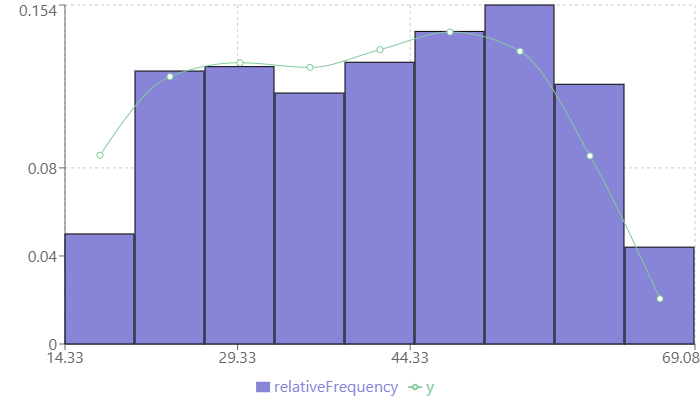
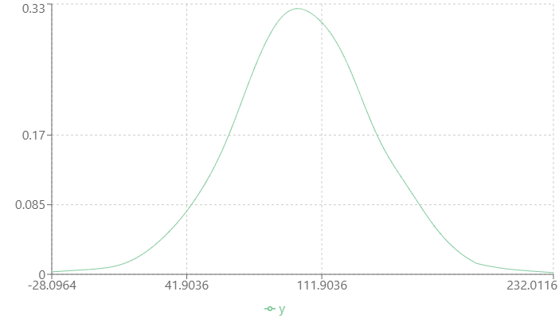
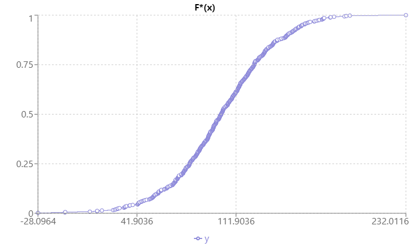
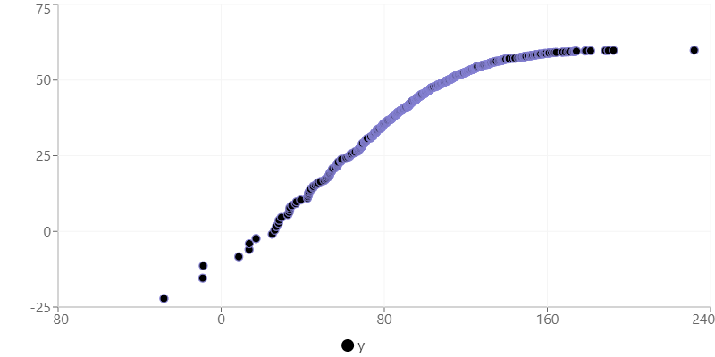
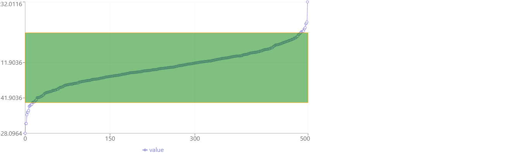

# Brief description

User-friendly platform for primary data analysis, distribution identification, histogram generation, ECDF, and KDE plotting

## Main Technologies
1. **Server**: 
   - Node.js
   - TypeScript
   - Express
2. **Web**: 
   - React.js
   - react-router-dom
   - recharts
   - html2canvas

## Snapshots

### Histogram


### Kernel Density Estimation


### Empirical Cumulative Distribution Function


### Probability Paper


### Abnormal Values


## Usage

1. Start the server:
    ```sh
    cd ./server
    npm start
    ```

2. Start the web application:
    ```sh
    cd ./web
    npm start
    ```

## Requirements

- Node.js (version x.x.x)
- npm (version x.x.x)

## Installation

1. Clone the repository:
    ```sh
    git clone https://github.com/MarkKlep/stat-analysis.git
    ```

2. Install server dependencies:
    ```sh
    cd ./server
    npm install
    ```

3. Install web dependencies:
    ```sh
    cd ./web
    npm install
    ```
